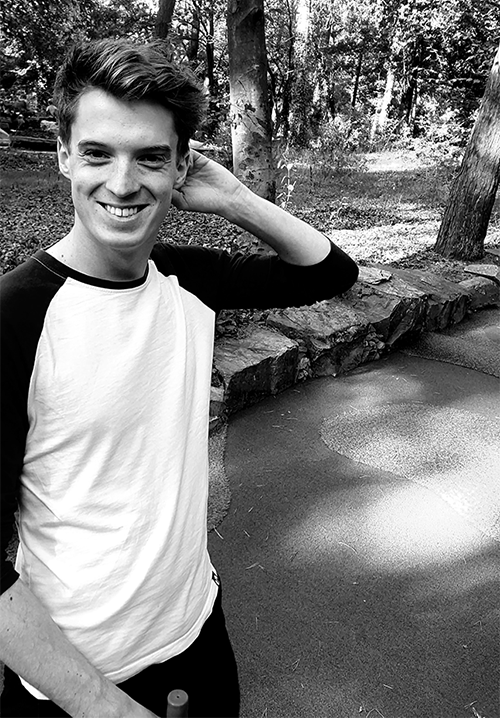

# Jan Deschacht

## About me

From an early age I was interested in technology and science. In addition to being a team player, I am driven, passionate and eager to learn. Because I have already tried different course, I have a background in html, css, design and communication.

## Contact

:telephone_receiver: +0478 76 37 45  

:email: jandeschacht33@gmail.com  

:house_with_garden: Ostend, West-Flanders  

:round_pushpin: Ghent, East-Flanders  

:cake: 3rd July 1998  

## Social

* [LinkedIn](https://www.linkedin.com/in/jan-deschacht-81a888178/ "LinkedIn")  
* [Github](https://github.com/pgm-jandeschacht "Github")  
* [Facebook](https://www.facebook.com/jan.deschacht/ "Facebook")  
* [Instagram](https://www.instagram.com/jandeschacht/ "Instagram")  
* [Twitter](https://twitter.com/BanantjeJan "Twitter")  

## Skills

* **Web Development:**   
* **Adobe:**    
* **Office:** Word, Excel, Powerpoint
* **Languages:** Dutch, English, French

## Education

* *2020 - present day*, City of Ostend  
  **Zone Leader Summerteam Ostend**  

* *2018 - 2020*, City of Blankenberge  
  **Administrative assistant**  

* *2017*, TUI headquarters Ostend  
  **Administrative assistant**  

* *2016*, City of Ostend  
  **Beachteam Ostend**  

* *2016*, Natra Jacali Bredene  
  **Production worker**  

* *2013 - 2016*, AD Delhaize De Haan  
  **Butcher**  

## Experience

* *2020 - present day*,  Artevelde university college  
  **Associate degree Programming**  

* *2018 - 2020*,  Artevelde university college  
  **Graphic design** (unfinished)  

* *2016 - 2018*,  Artevelde university college  
  **Communication management** (unfinished)  

* *2012 - 2016*,  Onze-Lieve-Vrouwecollege Oostende  
  **Mathematics and Sciences**  
  
* *2010 - 2012*,  Onze-Lieve-Vrouwecollege Oostende  
  **Latin**  

## Interests & Hobbies

:computer: Technology  
:european_castle: History  
:money_with_wings: Cryptocurrency  
:running: Running  
:musical_score: Music (drums & percussion)  
:volleyball: Volleybal (Hermes Oostende)  

## Github statistics

  

  